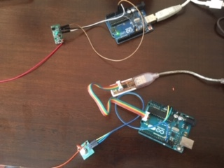
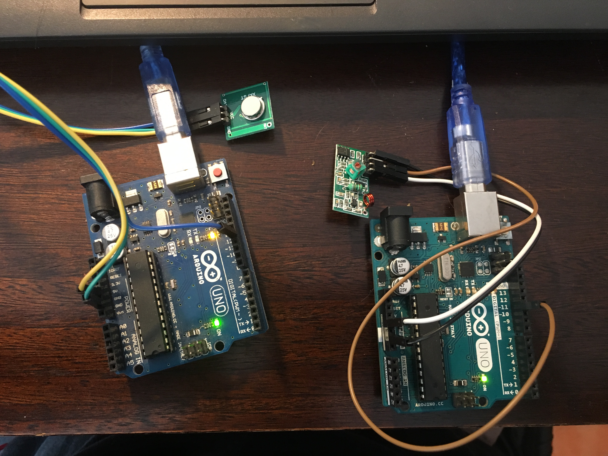
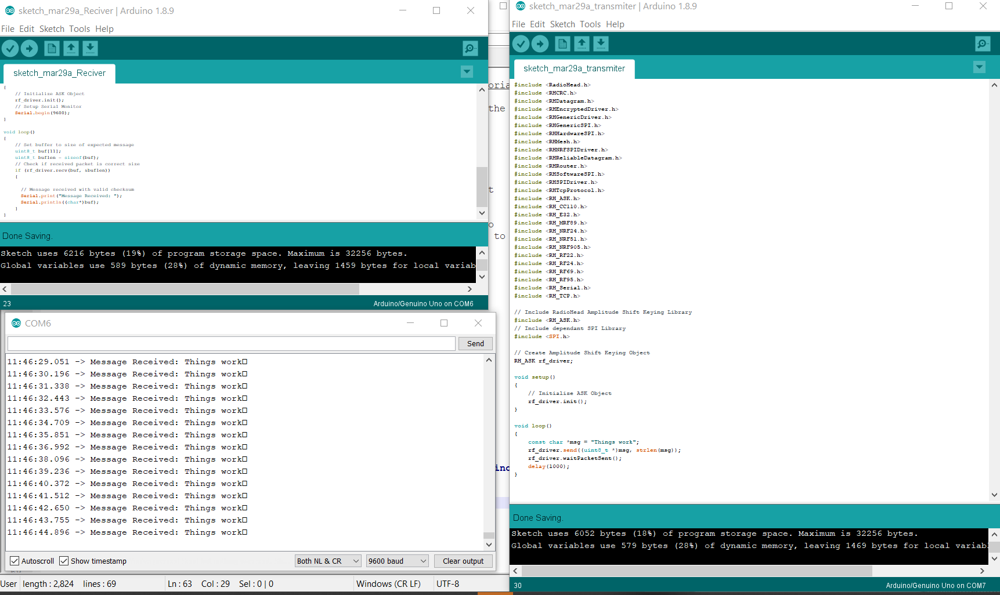

# SMI

Sistema de Monitoreo Inalambrico

---

## Overview

This section will record the development in using the 433mhz system. 

---

##  The Concept  

The system is composed of 2 pcb's: XY-MK-5V (Receiver) and XY-FS (Transmitter) [Henk Buursen@ wagg wk 14]  

They use Radio frequency, and if properly utilized can get to transmit over a period from 1 to 5 km in distance. 

Question arouse about the use of multiple FR433 modules simultaneously, and it can be done, but it requires some tweeting. " it may be possible to put each car in a separate frequency... other modules apply spread spectrum techniques to improve frequency usage ... the simplest of modules, single-frequency one-way only, it can possibly be done, if your band-rate is fast enough to allow for a lot of errors for your actual data rate" [multi433-source]  

Other Sources: [multi433-sourcevideo]

[multi433-sourcevideo]:https://www.youtube.com/watch?v=KFxhMtJEr9c

[multi433-source]:https://electronics.stackexchange.com/questions/281439/can-i-use-multiple-rf433-modules-at-the-same-time

[Henk Buursen@ wagg wk 14]: http://fab.academany.org/2018/labs/fablabamsterdam/students/henk-buursen/week14.html

Looking at the antennas and my pcb close, my transmitter seems to have lacking an antenna. A wire cut at 34.5cm = 1/2 wave length, 1/4 wave length is 17cm . [antennas] 

[antennas]: https://www.youtube.com/watch?v=OVsqGX0iBOM

Apparently, the receiver is also missing the ground section of the antenna. If we divide 17/4=4.25. The ground wire looks like it should be 4.25 cm. A rough approximate of the transmitter antenna gives us 5mm diameter, and 3 revolution 1.5cm *3 = 4.5 aprox. 4.25. 

The setup is as follows:  
  
Unfortunately I only have ONE usb "C" for Arduino. This means I cannot connect both Arduinos at the same time. In this picture I am connecting the alternate Arduino with a ISP to power the device, Unfortunately I cannot see what is going on inside and I have not gotten the 433mhz signal transmitted.  
---

## Working Setup   

All the code was taken from [Source433mhz], where they not only talk about the connections, but go deep into how it all works, and the arrangement of the packages that are transmitted through Radio Frequency (RF) . 

[Source433mhz]:https://lastminuteengineers.com/433mhz-rf-wireless-arduino-tutorial/

It started working properly only when I included ALL the libraries regarding the "RADIOHEAD" library. It can be seen here with all the documentation: [radiohead_library]. Or downloaded directly here: [Radiohead library](docs/libraries/RadioHead-1.84.zip).   

[radiohead_library]: http://www.airspayce.com/mikem/arduino/RadioHead/

I tested the Arduino Transmitter and Receiver Data pins with a Oscilloscope and it corresponded to show signal was being sent.   
  
After, the Original 433 mhz modules seemed not to be transmitting, I decided to switch into new modules. After doing the proper connection, everything seemed to work out well.   

The working setup is as follows:   

###Arduino #1 :   
Arduino #1, 5V = Vcc Transmitter  
Arduino #1, Gnd = Gnd Transmitter  
Arduino #1, Digital Pin #12 = Data Transmitter  

>  **[Transmitter Code](docs/433_code/sketch_mar29a_transmiter/sketch_mar29a_transmiter.ino)**
  
###Arduino #2 :   
Arduino #2, 5V = Vcc Transmitter  
Arduino #2, Gnd = Gnd Transmitter  
Arduino #2, Digital Pin #11 = Data Transmitter  

>  **[Receiver Code](docs/433_code/sketch_mar29a_Reciver/sketch_mar29a_Reciver.ino)**

---  
###The Communication
 

---
## Final thoughts  
The Next step would be to solder on to the 17.3 cm wire in order to test the long range. It might have been that the 17 vs 17.3 cm changed the reception of the system and made the initial modules useless. Some literature suggested the 0.3 cm additional was met to add some room to soldering properly.   
The system is proven and could be used with this larger SMI.  