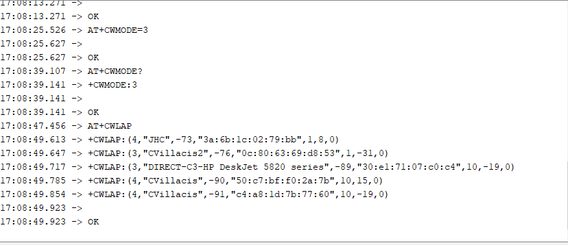
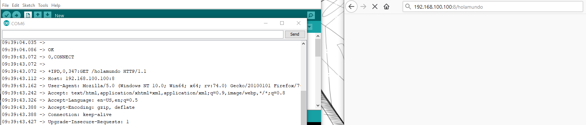
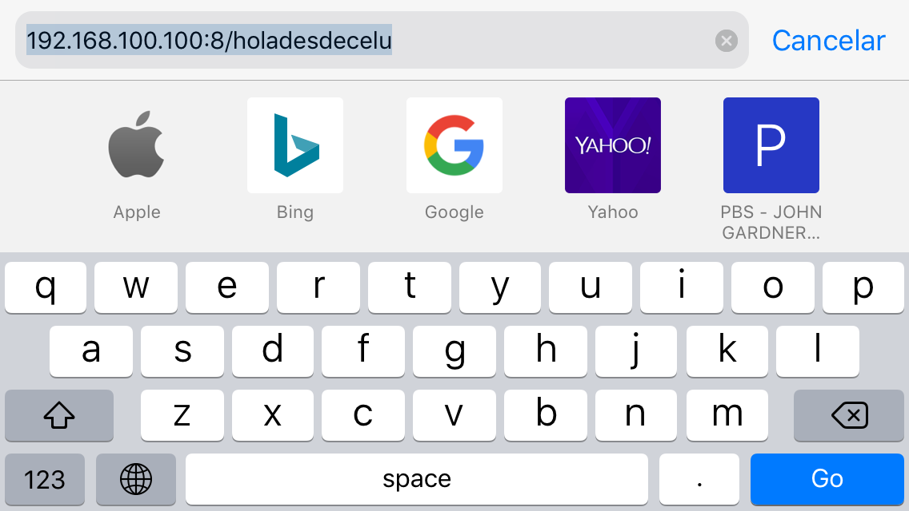
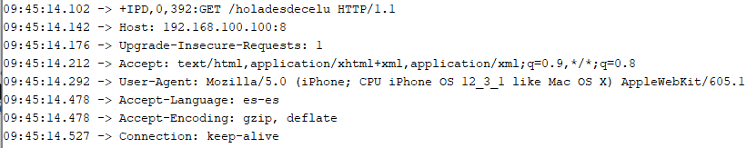

# SMI

Sistema de Monitoreo Inalambrico

---

## Overview

This section will record the experiments regardin the esp8266 module. This module, has the ability to connect to the wi-fi. As such, the esp8266 is a great alternative to use in this system.   
 
---
 
### The existing solution  

Currently there is no existing solution to the system. As the Fab system contains the end data transition in a screen in the hardware, and the output to the SD card. The objective of this next step is to tweet when the system finds an unexpected or potentially dangerous data reading.   

---

## Development

The development has been to follow the [ESP8266Arduinotutorial–WiFimodule], to better understand the system.  
  

This is the Pins the module uses. Important: VCC= 3.3v, 5v might burn the chip.  

		* AT – response OK  
		* AT+CWLAP – list nearby available WiFi networks  
		* AT+GMR – check the firmware version  
		* AT+CWJAP=”<access_point_name>”,”<password>” – join WiFi network using credentials  
		* AT+CIFSR – get current allocated IP address   

Datasheet: [esp8266ex_chipDatasheet]
AT Instructions: [esp8266_atinstructions]  
Module datasheet: [esp8266_01_moduleDatasheet]  

[esp8266ex_chipDatasheet]: https://www.espressif.com/sites/default/files/documentation/0a-esp8266ex_datasheet_en.pdf  
[esp8266_atinstructions]: https://www.espressif.com/sites/default/files/documentation/4a-esp8266_at_instruction_set_en.pdf  
[esp8266_01_moduleDatasheet]:[esp8266_01_moduleDatasheet]
After some time ill spent on the tutorial I have decide to go a different route, as I cannot replicate the communication between Arduino and  THE ESP8266.   

I used the tutorial [wifi_modulo_esp8266_conectarse], en español. It was a proponent of the idea that the Arduino Uno could be used, under the condition to remove the atmega 328p chip removed and adding a external power battery in order for the Arduino to have enough power through the 3.3v connection. It also requires the "ch pd" PIN to be in high. * follow on what that means form the datasheets * I am also not clear what that means when attempting to connect it to an Arduino with microcontroller, or maybe it is just the setup?

In this case, open Arduino IDE, connect the correct port and open under TOOS>serial monitor. Set the to: both NL & CR, and 115200(in this case).
Write: 
		
		 AT   
			* establish communication, response: ok  	
		 AT+CIOBAUD=9600  
			* it is preferable to work on 9600 baud, After command switch to 9600 baud  
		 AT+GMR  
			* asks the current version   
		 AT+CWMODE?  
			* What mode esp is working on.   
			* Mode 1= station, Mode 2= access point, Mode 3= station & access point  
		 AT+CWMODE=3  
			* Change to station and access point  
		 AT+CWLAP  
			* Look for current networks 
  

		 AT+CWJAP="JHC","1122334455"  
			* With this we select the network to connect to and its password  
		 AT+CIPMUX=1
			* Testing if the connection is correct. 
		 AT+CIPSERVER=1,80
			* Setting up the channel and the port to talk to the device. 
		 AT+CIFSR
			* Aquire the communication ip.
		 Response:   
			09:35:10.635 -> +CIFSR:APIP,"192.168.4.1"  
			09:35:10.686 -> +CIFSR:APMAC,"62:01:94:33:60:8f"  
			09:35:10.721 -> +CIFSR:STAIP,"192.168.100.100"  
			09:35:10.756 -> +CIFSR:STAMAC,"60:01:94:33:60:8f"  
		 SELECT CIFSR:STAIP + CIPSERVER RESULT + / MESSAGE 192.168.100.100:8/HOLAMUNDO 
		 Transmision through web browser:   

		 Transmision from a remote location, my iphone.  

 
		 The reciver end:   
  

###Cheek point:   Esp & Arduino  

The tutorial ends here. With this we not only proved that the esp is working but that it is relatively simple to interact with wi-fi, including sing in info and messages.  
It should be noted the esp is capable enough to be used independently, bypassing the Arduino completely and is what we did in the previous tutorial. It would be a shame to use Arduino board without its main microcontroller, so the next goal should be to communicate the esp directly, or to integrate both boards.  
 
---  

### Posting a tweet   

in the next project, I'm going to tweet with the ESP8266. The simplest way possible, though the Arduino shield with out the Atmel microcontroller. There are several tutorials, and with it different options:   
 * [posting_tweet1] = Using IFTTT and NodeMCU  
 * [posting_tweet2] = Using www.thinkspeak.com  
 * [posting_tweet3] = Using Blynk Library   
 
[posting_tweet1]:https://randomnerdtutorials.com/posting-a-tweet-with-the-esp8266/    
[posting_tweet2]:https://www.youtube.com/watch?v=PMwfJEh_6gI  
[posting_tweet3]:https://www.youtube.com/watch?v=qU8_z8iAoUQ
---

[wifi_modulo_esp8266_conectarse]:https://www.youtube.com/watch?v=7gXcTBHLCRc
[ESP8266Arduinotutorial–WiFimodule]:https://www.geekstips.com/esp8266-arduino-tutorial-iot-code-example/
### Other intresting references for safe keeping   
 * Three tutorials for ESP8266 and ESP32 [arduinojson.org]  
 * [ESP8266 - Beginner Tutorial + Project] - An ultimate tutorial for beginners on how to connect and use an ESP8266 via Arduino and program it to blink an LED using the Blynk app.  
 * [esp88266_lastminengineers]- Mostly getting time date, simple weather station, display multiple values on web server, etc. 
 * [ESP8266_arduino_core]- Exceptional library on everything between Arduino and esp8266, but its sort of advanced. 
 * [Estacion_meteorologica] video de youtube
 
 [Estacion_meteorologica]:https://www.youtube.com/watch?v=oW8w2d_SMA4  
 [arduinojson.org]:https://arduinojson.org/news/2018/09/24/three-tutorials/  
 [ESP8266 - Beginner Tutorial + Project]:https://create.arduino.cc/projecthub/Niv_the_anonymous/esp8266-beginner-tutorial-project-6414c8  
 [esp88266_lastminengineers]: https://lastminuteengineers.com/electronics/esp8266-projects/  
Safe-keeping the following address in order to always have access.   
https://jorgehcorrea.github.io/documentation  
[ESP8266_arduino_core]:https://arduino-esp8266.readthedocs.io/en/latest/installing.html  
